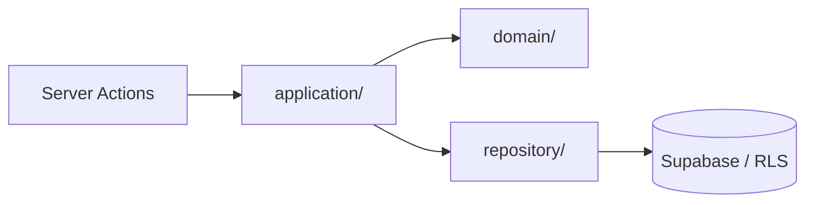

# Domain modules — modular monolith

Business logic lives in per-domain modules under `src/modules/`. This layer is a **modular
monolith**: modules are separated by clear boundaries (public `index.ts` + ESLint rules), but run in
one process. Service extraction is V2+.

## Layer pattern

Every **implemented** module follows three layers:

- `application/` — use-case orchestration (server actions import from here)
- `domain/` — pure business logic, types, validators (no I/O)
- `repository/` — data-access via the admin/server Supabase client (RLS-enforced)

Modules export ONLY through `src/modules/<name>/index.ts`. Deep imports
(`@/modules/audit/domain/csv`) are forbidden by an ESLint rule (ENGINEERING-02A) — consume a module
through its public index.

## Module status

> This table is **not** maintained by hand alone: it is backed by
> [`module-manifest.json`](./module-manifest.json) and CI-guarded by
> `scripts/check-module-manifest.js` (ENGINEERING-29). If the code and the manifest drift apart, CI
> fails — so a "status" or "public API" claim here is CI evidence, not a promise.

### Implemented (14)

| Module              | Status      | Public API highlights                                             | Layers                          |
| ------------------- | ----------- | ----------------------------------------------------------------- | ------------------------------- |
| `admin`             | implemented | grantSupportAccess, revokeSupportAccess, inviteMember, AdminRepository | application · domain · repository |
| `anti-gaming`       | implemented | runScan, AntiGamingRepository                                     | application · domain · repository |
| `audit`             | implemented | exportAudit, AuditRepository, CompAccessRepository, csvField, jsonbField, AUDIT_CSV_HEADER | application · domain · repository |
| `bonus-calculation` | implemented | runCalculation, recalculate, allocateBonus, BonusCalculationRepository | application · domain · repository |
| `bonus-ledger`      | implemented | postAccrual, BonusLedgerRepository                                | application · domain · repository |
| `bonus-periods`     | implemented | createPeriod, createPool, BonusPeriodsRepository                 | application · domain · repository |
| `disputes`          | implemented | openDispute, assignReviewer, resolveDispute, DisputeRepository, DisputeAdjustmentRepository | application · domain · repository |
| `exports`           | implemented | exportPayout, markPaid, ExportsRepository                        | application · domain · repository |
| `outbox`            | implemented | enqueueOutboxEvent, drainOutbox, OutboxRepository, DEFAULT_OUTBOX_HANDLERS | application · domain · repository |
| `point-ledger`      | implemented | manualOverride, PointLedgerRepository                            | application · domain · repository |
| `reconciliation`    | implemented | runReconciliation, ReconciliationRepository                      | application · domain · repository |
| `reviews`           | implemented | reviewTask, ReviewRepository                                     | application · domain · repository |
| `scoring`           | implemented | getScoringBreakdown, ScoringRepository                           | application · domain · repository |
| `tasks`             | implemented | createTask, submitTask, TaskRepository                          | application · domain · repository |

### Placeholder (7)

| Module          | Status      | Public API | Layers | Note                                                                       |
| --------------- | ----------- | ---------- | ------ | -------------------------------------------------------------------------- |
| `auth`          | placeholder | —          | —      | Auth helpers intentionally live in `src/lib/auth` (Phase 3.5); reserved for V2+ promotion. |
| `bonus-pools`   | placeholder | —          | —      | Pool logic currently lives in `bonus-periods` (`createPool`).              |
| `notifications` | placeholder | —          | —      | Delivery engine is future work; the outbox module is the async substrate.  |
| `organizations` | placeholder | —          | —      | Org bootstrap is a SECURITY DEFINER RPC (`create_organization`).           |
| `reports`       | placeholder | —          | —      | Dashboards read via existing modules; no dedicated domain yet.             |
| `teams`         | placeholder | —          | —      | Team management is seed/admin-managed (out of MVP).                        |
| `users`         | placeholder | —          | —      | Identity is `src/lib/auth` + invitations (`admin.inviteMember`).           |

Placeholder folders keep their `.gitkeep` (they hold no code yet); implemented modules must NOT — the
drift gate rejects a stale `.gitkeep` in an implemented module.

## Architecture context

## Machine-readable manifest

[`src/modules/module-manifest.json`](./module-manifest.json) is the source of truth for module
status + public API, verified in CI by `scripts/check-module-manifest.js`. Drift (an unregistered
folder, a `placeholder` with an `index.ts`, an `implemented` without one, or a stale `.gitkeep`) is a
CI failure.
